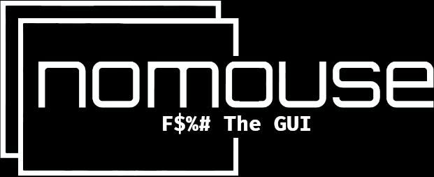

<div align="center">
  <a href="https://github.com/TrustArgon/nomouse">
    
  </a>

<h3 align="center">nomouse i3 dotfiles</h3>

  <p align="center">
    Highly functional i3 customization with dual monitor support.
    <br />
    <a href="https://github.com/TrustArgon/nomouse"><strong>Explore the docs »</strong></a>
    <br />
    <br />
    <a href="https://github.com/TrustArgon/nomouse">View Demo</a>
    ·
    <a href="https://github.com/TrustArgon/nomouse/issues">Report Bug</a>
    ·
    <a href="https://github.com/TrustArgon/nomouse/issues">Request Feature</a>
  </p>
</div>


<!-- TABLE OF CONTENTS -->
<details>
  <summary>Table of Contents</summary>
  <ol>
    <li>
      <a href="#about-the-project">About The Project</a>
      <ul>
        <li><a href="#built-with">Built With</a></li>
      </ul>
    </li>
    <li>
      <a href="#getting-started">Getting Started</a>
      <ul>
        <li><a href="#prerequisites">Prerequisites</a></li>
        <li><a href="#installation">Installation</a></li>
      </ul>
    </li>
    <li><a href="#usage">Usage</a></li>
    <li><a href="#roadmap">Roadmap</a></li>
    <li><a href="#contributing">Contributing</a></li>
    <li><a href="#license">License</a></li>
    <li><a href="#contact">Contact</a></li>
    <li><a href="#acknowledgments">Acknowledgments</a></li>
  </ol>
</details>


<!-- ABOUT THE PROJECT -->
## About The Project

i3 is a highly customizable tiling window manager. It makes the use of screen real-estate extremely efficient. 

<p align="right">(<a href="#readme-top">back to top</a>)</p>


### Built With

* i3 Window Manager
* py3status

<p align="right">(<a href="#readme-top">back to top</a>)</p>


<!-- GETTING STARTED -->
## Getting Started

Setup is rather simple. Configuration options are endless.

### Prerequisites

This is an example of how to list things you need to use the software and how to install them.
* i3 Window Manager or i3-gaps if you're so inclined (if its not already installed)
  ```sh
  sudo apt install i3
  ```
* py3status
  ```sh
  sudo apt install py3status
  ```
* [Install Nerd Fonts](<LeftMouse>https://github.com/ryanoasis/nerd-fonts#option-3-install-script)
  * I prefer FiraCode but use whatever you wish.


### Installation

1. Clone the repo
   ```sh
   git clone https://github.com/TrustArgon/nomouse.git
   ```
2. Copy the dotfiles into your local profile
   ```sh
   cp nomouse/i3/config ~/.config/i3/config
   cp nomouse/py3status/config ~/.config/py3status/config
   ```
4. Set monitors in i3 config:
   ```sh
   #~/.config/i3/config:
   set $monitor_left <LEFT_MONITOR>
   set $monitor_right <RIGHT_MONITOR>
   ```

<p align="right">(<a href="#readme-top">back to top</a>)</p>

<!-- CONTRIBUTING -->
## Contributing

Contributions are what make the open source community such an amazing place to learn, inspire, and create. Any contributions you make are **greatly appreciated**.

If you have a suggestion that would make this better, please fork the repo and create a pull request. You can also simply open an issue with the tag "enhancement".
Don't forget to give the project a star! Thanks again!

1. Fork the Project
2. Create your Feature Branch (`git checkout -b feature/AmazingFeature`)
3. Commit your Changes (`git commit -m 'Add some AmazingFeature'`)
4. Push to the Branch (`git push origin feature/AmazingFeature`)
5. Open a Pull Request

<p align="right">(<a href="#readme-top">back to top</a>)</p>


<!-- LICENSE -->
## License

Distributed under the MIT License. See `LICENSE.txt` for more information.

<p align="right">(<a href="#readme-top">back to top</a>)</p>


<!-- CONTACT -->
## Contact

Project Link: [https://github.com/TrustArgon/nomouse](https://github.com/TrustArgon/nomouse)

<p align="right">(<a href="#readme-top">back to top</a>)</p>

